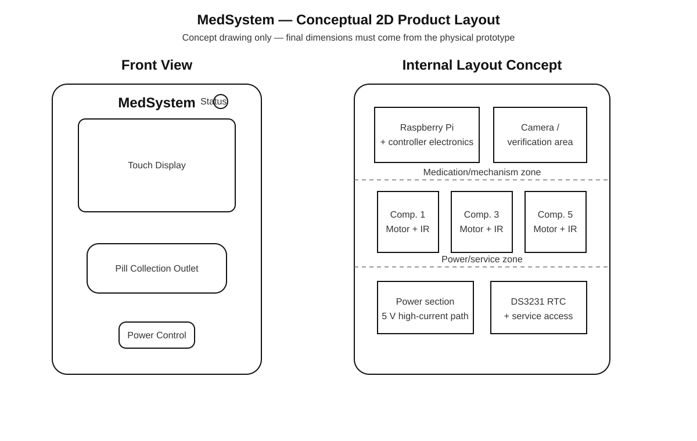

# MedSystem Design and Architecture

This document describes the current MedSystem smart medication dispenser as implemented in the repository. It is intended for project documentation, engineering handover, demonstrations, and future product development.

## 1. Design Objective

MedSystem is designed to reduce missed doses, incorrect pill quantities, weak medication records, and poor visibility for caregivers by combining physical dispensing with software scheduling and verification.

The system is organized around five functional layers:

1. **User interaction** — touchscreen, web dashboard, and Android app.
2. **Medication management** — patients, medications, schedules, stock, and adherence.
3. **Dispensing control** — stepper-driven compartments with continuous IR pill counting.
4. **Verification** — camera evidence and AI-assisted medication verification for supported classes.
5. **Device services** — time synchronization, automatic dispensing, logging, alarms, and network access.

## 2. System Architecture


The Raspberry Pi is the device controller and hosts the local backend. The dashboard and Android app communicate with the device through the MedSystem API. Medication schedules remain authoritative on the dispenser so normal scheduled operation does not depend on the Android application remaining open.

## 3. Physical Product Concept



The 2D drawing is a **product-layout concept**, not a manufacturing drawing. Final enclosure dimensions should be taken from the actual TFT, Raspberry Pi mounting points, medication cartridges, motors, wiring clearances, pill outlet, camera module, and power hardware.

### Front interface

The intended front interface contains:

- MedSystem identity mark
- Touch display
- medication-ready / warning indication
- pill collection outlet
- accessible but protected power control

### Internal arrangement

The design should separate:

- user-facing electronics from moving mechanisms;
- medication compartments from power electronics;
- camera/evidence area from motor wiring;
- service-access components from normal patient-access components.

## 4. Dispensing Mechanism


The current prototype enables compartments **1, 3, and 5**. Compartments 2, 4, and 6 are reserved for a later hardware revision.

For each enabled path:

1. A scheduled dose becomes due.
2. The assigned stepper begins rotating.
3. The paired IR detector watches the pill path continuously.
4. A valid clear-to-detect transition increments the count.
5. The sensor must clear before another pill can be counted.
6. Rotation continues until `actual_count == target_count`.
7. The motor stops immediately when the prescribed quantity is reached.
8. A safety timeout remains as a fallback for jams or missing pills.

This is intentionally **count-driven rather than rotation-driven**. The number of shaft turns is not used as the medication quantity.

## 5. Verification Strategy

MedSystem supports two medication verification modes.

### AI-supported medication

For medicines represented in the configured model/class list:

- pill quantity is confirmed by the IR counting path;
- the camera captures evidence;
- AI classification is used as an additional verification signal;
- the result is recorded with the dispense event.

### Custom medication

For medication that is not represented in the trained AI list:

- scheduled dispensing still works;
- pill quantity is still counted by IR;
- camera evidence is still stored;
- AI classification is skipped rather than fabricating a prediction.

## 6. Medication Setup Workflow

The user-facing schedule flow follows the same logical structure across the TFT, dashboard, and Android app:

```text
Select patient
      ↓
Choose medication source
      ├── AI-supported medication
      ├── Registered medication
      └── Medication not listed
      ↓
Set dose time
      ↓
Set quantity
      ↓
Set repeat days
      ↓
Save schedule
```

The software should avoid exposing unnecessary implementation details such as Raspberry Pi IP addresses, model filenames, internal service names, or GPIO terminology to normal patients and caregivers.

## 7. Time Architecture

Medication timing is safety-critical. The dispenser therefore uses the Raspberry Pi system clock as the operational clock and synchronizes it from network time when internet access is available.

The DS3231 RTC provides retained hardware time for offline operation.

```text
Internet / NTP
      ↓
Raspberry Pi system time
      ↓
DS3231 RTC synchronized periodically
      ↓
Schedules, logs and evidence timestamps
```

If internet access is unavailable, the existing RTC time is preserved. When network synchronization returns, the Pi clock is corrected and the RTC is updated again.

## 8. Current Hardware Revision

| Function | Current implementation |
|---|---|
| Main controller | Raspberry Pi |
| User display | TFT touchscreen |
| RTC | DS3231 |
| Pill sensing | IR sensing through I²C expander |
| Dispensing | Stepper motors |
| Active compartments | 1, 3, 5 |
| Camera | Raspberry Pi-compatible camera path |
| Alert | Buzzer + software status |
| Dashboard | React/Vite web application |
| Mobile | Capacitor Android application |
| Backend | Flask API + SQLite |

## 9. Product Design Principles

For future revisions, the device should preserve these principles:

- **Patient-first interface:** medication terminology rather than engineering terminology.
- **Fail-safe motor behavior:** every motor path must return to a safe-off state.
- **Quantity verification:** dose completion must be based on confirmed pill count.
- **Local-first operation:** scheduled dispensing should not depend on cloud availability.
- **Evidence without false certainty:** AI should supplement, not replace, deterministic sensing.
- **Serviceability:** motors, sensors, cartridges, wiring, camera, and power sections should be replaceable without dismantling the full product.
- **Power integrity:** Raspberry Pi power switching must use a low-resistance, correctly rated power path; production designs should prefer a high-side load switch or MOSFET power controller rather than routing full Pi current through a small front-panel switch.

## 10. Prototype Status

The repository represents a working engineering prototype and academic/research platform. The visual drawings in this documentation are conceptual engineering illustrations. Final manufacturing, medical-device certification, cybersecurity validation, electrical safety, EMC, reliability, and clinical validation are outside the current prototype scope.